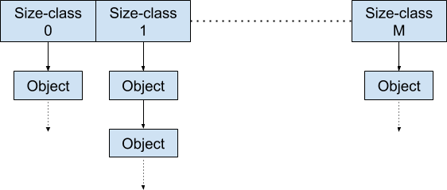

# TCMalloc设计文档学习

TCMalloc全名Thread-Caching Malloc，是Google开发的用来替代传统malloc函数的内存分配库，它的竞争对手主要是jemalloc, glibc malloc等。我们主要学习它的设计思路。

首先要明确的一点就是tcmalloc为什么这么快，大量使用无锁操作是tcmalloc
快的重要原因。下图是tcmalloc的架构图：

我们可以把TCMalloc分成三个部分来看：

- front-end 是应用分配或者归还内存的一个缓存层，以前的模式是每个线程一个缓存层，现在tcmalloc的模式是每个逻辑CPU一个。他们的原理都在于，一个逻辑CPU同一时间只能执行一个线程的代码，线程是操作系统的最小调度单位。因此缓存层可以进行无锁操作，速度会很快。
- middle-end 是负责给front-end层提供内存的。
- back-end 是负责给middle-end层提供内存的。

当front-end内存不足需要新的内存时，就会去middle-end获取，当middle-end
不足时，就会去back-end获取。

## Front-end

当front-end处理小对象分配时，front-end会根据所需要内存大小，把它们向上取整到固定的60-80种可分配的大小，[见此](https://github.com/google/tcmalloc/blob/master/tcmalloc/size_classes.cc)，
比如请求分配12kb时，会分配一块大小为16kb的内存，这样做的好处是所有分配出去的内存块大小都是固定的（虽然有不同的大小），可以避免内存碎片，当然，缺点就是有一小部分内存会被浪费。

其中有一个参数是 `kMaxSize`，如果所申请的内存大小比它大，那么就会直接从 back-end 去获取。

在 `per-thread` 模式下，内存块如下处理：

申请内存时，从对应的链表中取出，释放内存时，放入对应的链表中。而当内存块超量或者不足时，就会由middle-end进行处理。

在 `per-cpu` 模式下，则是如下处理：

对于每一个逻辑处理器，都有一块内存用来保存元信息，也就是sized-class对应内存块的分配信息。里面的 `size class 0 objects`
是一个指针数组，指针指向对应大小的内存块。header里保存了指针数组的起始位置、当前分配位置和末端位置。数组的大小在启动时就会确定好。

## Middle-end

middle-end负责从back-end获取内存，然后提供给front-end使用，对于front-end来说相当于一个全局内存获取处。

middle-end 获取或者归还内存需要加锁，因此从这里获取或者归还内存是有开销的。

middle-end由两部分组成，一个是 `Transfer Cache`，一个是 `Central Free List`。`Transfer Cache` 直接和 front-end 接触，当这一层内存不够时，才会涉及到 `Central Free List`。

`Central Free List` 以页(page)的形式管理内存。把连续的多个page组成一个span。当获取内存时，从这里取出一些page，划分成对应大小(size class)的内存。

## Back-end

back-end 负责从OS获取内存，然后提供给middle-end。同样，它也是以page为单位管理内存。

back-end有两种实现，一种是传统实现，用一个指针数组来存储内存，如下：

另外一种就是 [Hugepage-Aware Allocator](https://github.com/google/tcmalloc/blob/master/docs/temeraire.md)。

以上就是tcmalloc的设计，通篇读下来，tcmalloc还是挺复杂的，很多细节处都仔细的设计了。

---

参考资料：

- https://github.com/google/tcmalloc/blob/master/docs/design.md
- https://github.com/google/tcmalloc
- https://github.com/google/tcmalloc/blob/master/docs/temeraire.md
