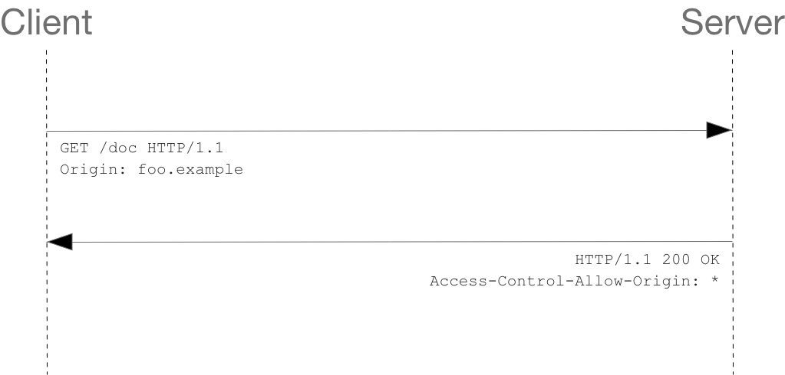
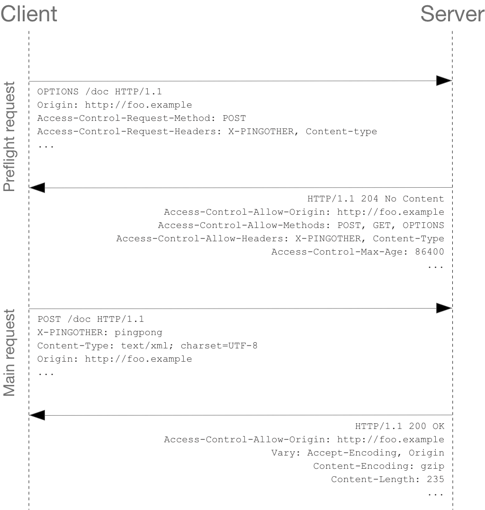

# 搞定CORS问题

帮我配置一下跨域...跨域了,没法请求...这是日常开发中经常遇到的问题,最近好好的阅读了一下相关文档,这篇文章是
学习笔记.

CORS的全称是 Cross-Origin Resource Sharing, 分别取首字母. 其实就是用来控制不同域名(所以叫跨域)下的资源共享问题.
有的时候,我们希望我们的域名下的资源可以被大家都访问,有的时候,为了安全,我们希望域名下的资源只能被同域名或者是
我们允许的域名来访问. 这也是CORS的作用.

## 破解CORS

为了理解CORS的工作机制,首先我们就要理解它是怎么个运作法,CORS的核心原理,其实就是浏览器遵循一套准则:

Cross-Origin Resource Sharing (CORS) is an HTTP-header based mechanism that allows a server to indicate
any other origins (domain, scheme, or port) than its own from which a browser should permit loading of
resources. CORS also relies on a mechanism by which browsers make a “preflight” request to the server
hosting the cross-origin resource, in order to check that the server will permit the actual request.
In that preflight, the browser sends headers that indicate the HTTP method and headers that will be
used in the actual request.

可以简单的理解为:

- 首先,这套规范需要服务端和客户端共同遵循,支持才能实现
- 服务端下发一些指定的头部来指示客户端是否可以访问
- 客户端, 通常是浏览器, 遵循这套指示

也真是因此, CORS可以轻易被破解: 不在浏览器发起请求. 比如我们服务端直接去请求某个API. 这种方式在前端同事开发的时候,
经常会用到,他们会时常用一个反向代理来代理请求,这样,发起请求的就不是浏览器而是代理软件.

## 理解CORS

浏览器大都遵循同源策略, 也就是说, 如果两个请求的 协议, host 和端口都相同, 那么就认定为同源, 否则不同源. 原文如下:

> Two URLs have the same origin if the protocol, port (if specified), and host are the same for both. You may see
> this referenced as the "scheme/host/port tuple", or just "tuple". (A "tuple" is a set of items that together
> comprise a whole — a generic form for double/triple/quadruple/quintuple/etc.)

同源的请求, 浏览器直接放行, 否则, 就需要进行CORS的校验, 如果CORS校验成功, 那么放行, 否则, 拒绝, 而且为了安全原因,
js拿不到具体的错误信息, 只能打开console看日志.

接下来我们来看看CORS是怎么校验的. 我们可以把请求类型分为三类来理解:

### 简单请求

对于简单请求, 浏览器会直接发起请求, 简单请求的定义是, 必须满足以下所有条件:

- 使用 `GET`, `POST`, `HEAD` 三种方法之一
- 除了浏览器添加的标准头部之外, 只添加了 `Accept`, `Accept-Language`, `Content-Language`, `Content-Type` 这几个头部,
不能添加其他自定义头部
- `Content-Type` 只能是以下三种之一: `application/x-www-form-urlencoded`, `multipart/form-data`, `text/plain`
- 没有调用 `xhr.upload.addEventListener()`
- 没有使用 `ReadableStream` 对象

此类请求, 浏览器直接发起请求, 服务端应该返回一个头部 `Access-Control-Allow-Origin: *`, 值也可以是具体的域名.



参考: https://developer.mozilla.org/en-US/docs/Web/HTTP/CORS#simple_requests

### preflight 请求

对于不满足上述条件的请求, 浏览器会先发起一个 `OPTIONS` 请求, 如果服务端返回的头部里含有对应的响应, 浏览器才会接下来才会
发起真正的请求.



注意这几个响应头部:

```
Access-Control-Allow-Origin: https://foo.example
Access-Control-Allow-Methods: POST, GET, OPTIONS
Access-Control-Allow-Headers: X-PINGOTHER, Content-Type
Access-Control-Max-Age: 86400
```

- `Access-Control-Allow-Origin` 还是表明允许的访问来源, 如果是 `*` 就表示允许任意来源
- `Access-Control-Allow-Methods` 表示允许的访问方法
- `Access-Control-Allow-Headers` 表示允许添加的头部
- `Access-Control-Max-Age` 表示允许记住preflight请求的时间, 也就是说,对于同一个请求, 这段时间内不会再次发起preflight请求

### 带凭证的请求

默认情况下, 请求是不带凭证的, 这里的凭证也就是说 cookie 和 HTTP Authentication 信息. 但是,
当请求设置了 `invocation.withCredentials = true;` 之后, 就变成了带凭证的请求.

此时, 需要服务端返回 `Access-Control-Allow-Credentials: true` 头部, 而且响应时, `Access-Control-Allow-Origin` 头部一定
不能传 `*`, 而是只能传一个真是的源站, 比如 `http://foo.example`.

最后还有一个头部我们没有讲到, 那就是 `Access-Control-Expose-Headers`, 通过这个头部, 可以设置响应中的某些头部是允许被
浏览器访问的.

这就是CORS的全部内容了, 通篇了结以下之后,其实也不难, 哈哈.

---

Ref:

- https://developer.mozilla.org/en-US/docs/Web/HTTP/CORS
